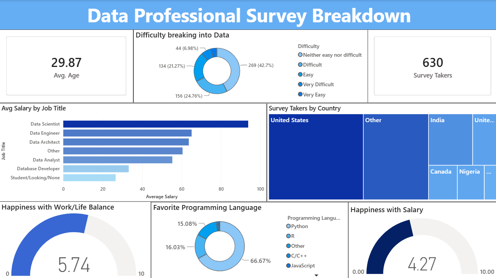

# Data Professional Survey Breakdown

A Power BI dashboard built from survey responses collected from 630 data professionals, exploring salary trends, job satisfaction, the difficulty of breaking into the data field, and programming language preferences across roles and countries.

## Overview

This project analyzes a real-world survey dataset to uncover trends in compensation, satisfaction, and career accessibility within the data industry. The dataset was provided in raw form and required substantial cleaning before it could be analyzed. Using Power Query, I standardized inconsistent values, converted salary ranges into numerical data, and prepared the dataset for visualization in Power BI. The result is an interactive dashboard covering key metrics across job titles and countries.

## Data Source

The dataset was collected and shared by Alex The Analyst on Youtube through a survey of data professionals. It was provided unprocessed, with no cleaning performed beforehand.

## Tools Used

- Power BI Desktop
- Power Query
- Microsoft Excel

## Data Cleaning

The raw dataset had two major issues that needed to be resolved before analysis. Salary was stored as text ranges rather than numbers, which meant averages and comparisons weren't possible until each range was converted into a numerical midpoint. The country field was even messier: respondents who selected "Other" had typed their country into a free-text box, resulting in dozens of inconsistent entries from typos, inconsistent capitalization, and duplicate spellings of the same country. Standardizing and consolidating these values also revealed a few countries with meaningful respondent counts that had been hidden inside a generic "Other" category.

## Key Findings

- Salary satisfaction was the lowest-rated metric in the survey, despite higher pay being the top factor respondents looked for in a new role.
- The United States accounted for roughly 41% of respondents and reported noticeably higher average salaries than other countries in the dataset.
- Most respondents found breaking into the data field neither easy nor difficult (42.7%), though slightly more people leaned toward "difficult" than "easy."
- Python was the most widely used programming language, preferred by nearly two-thirds of respondents.

## Dashboard Features

- KPI cards for total respondents and average age
- Average salary by job title, with a gradient fill to reflect relative pay
- Country distribution shown as a treemap
- Salary satisfaction and work-life balance gauges
- Career entry difficulty breakdown
- Programming language preference breakdown
- A single consistent color theme, with one accent color used to highlight the lowest-scoring metric

## Files

- `Data_Survey_Project.pbix` — the Power BI dashboard file
- `dashboard-screenshot.png` — static preview of the dashboard

---

Connect with me on [LinkedIn](www.linkedin.com/in/aryannair767).
